# PEB submodule — experiment results

This page browses the figures and metric CSVs produced by every phase
of the `reaction_diffusion_peb/` submodule. The numbers are also
embedded in [`docs/peb_submodule.md`](../docs/peb_submodule.md); this
file is the visual companion. The datasets (`outputs/datasets/*.npz`,
~410 MB) are deliberately not committed — they are regenerable by
running the Phase-9 scripts.

To regenerate everything from scratch:

```bash
pytest reaction_diffusion_peb/tests/ -q       # 215 tests
# then run any of the experiments listed below.
```

---

## Phase 1 — synthetic aerial + exposure

Aerial intensity → Dill-style exposure → initial acid `H_0`.

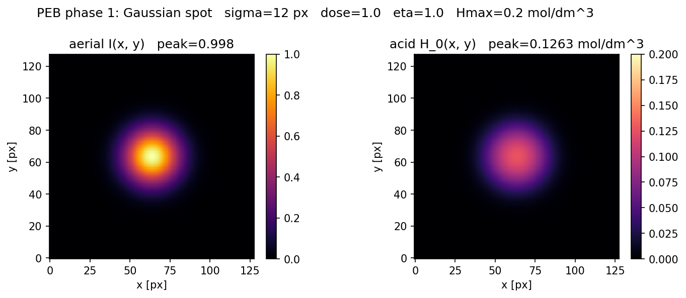
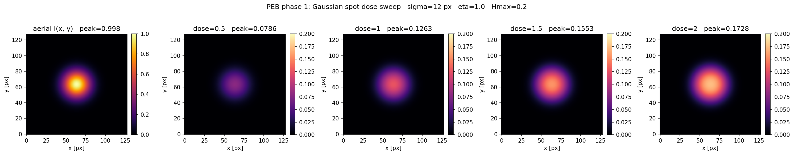
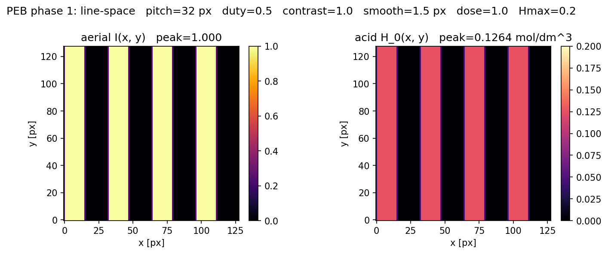
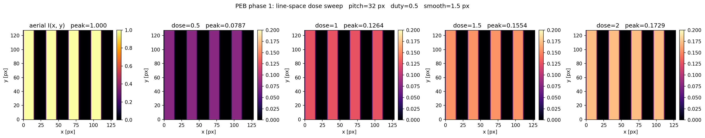

Metrics: [`peb_phase1_gaussian_metrics.csv`](outputs/logs/peb_phase1_gaussian_metrics.csv),
[`peb_phase1_line_space_metrics.csv`](outputs/logs/peb_phase1_line_space_metrics.csv)

---

## Phase 2 — diffusion-only FD / FFT baselines

CFL-bounded explicit Euler vs the exact heat-kernel solution.

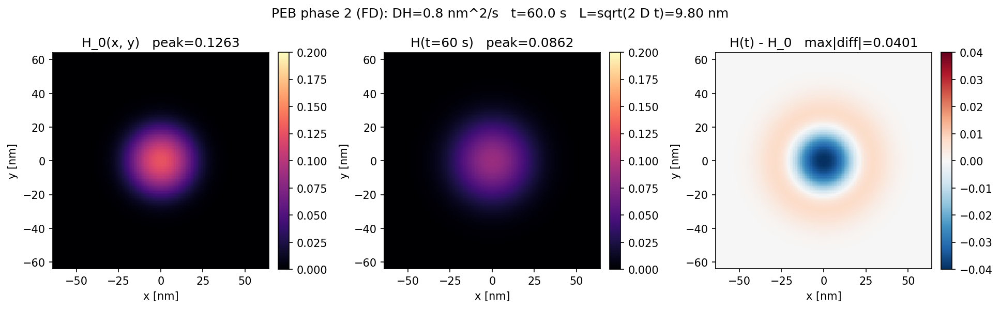

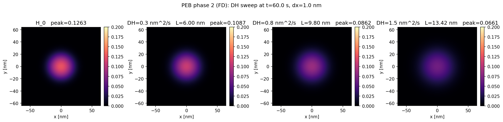

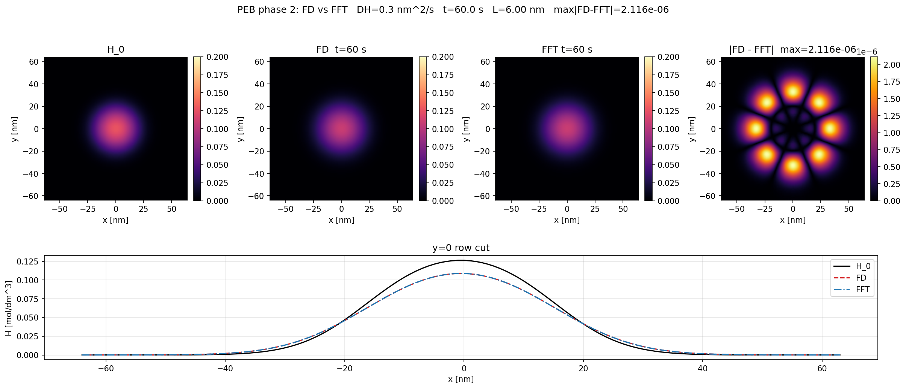
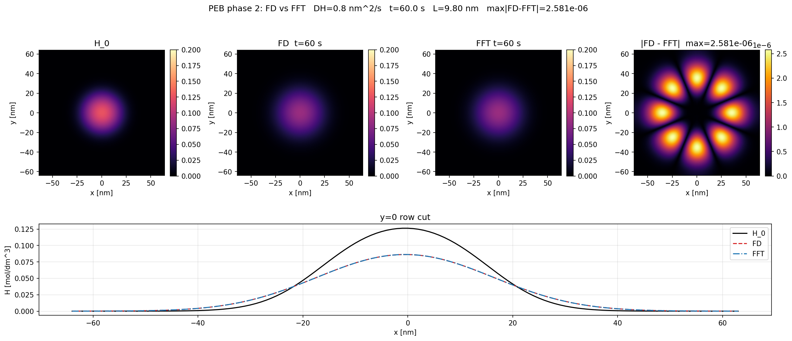
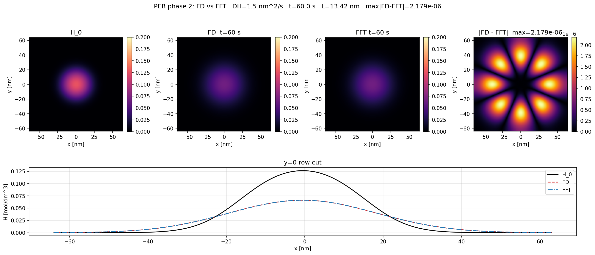

Metrics: [`peb_phase2_fd_metrics.csv`](outputs/logs/peb_phase2_fd_metrics.csv),
[`peb_phase2_fft_metrics.csv`](outputs/logs/peb_phase2_fft_metrics.csv),
[`peb_phase2_compare_fd_fft_metrics.csv`](outputs/logs/peb_phase2_compare_fd_fft_metrics.csv)

---

## Phase 3 — PINN diffusion vs FD / FFT

Hard-IC PINN: `H = H_0(x, y) + t_norm * MLP_out`.

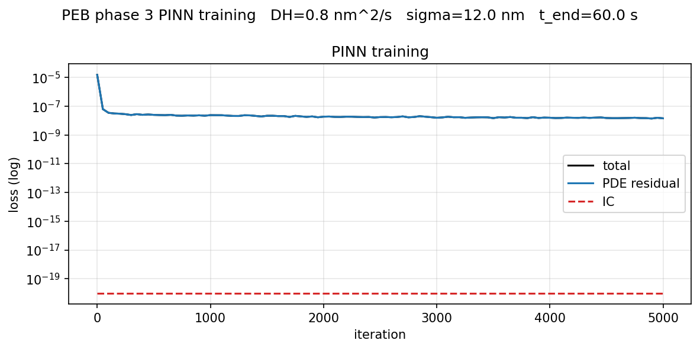


Metrics: [`peb_phase3_compare_fd_fft_pinn_metrics.csv`](outputs/logs/peb_phase3_compare_fd_fft_pinn_metrics.csv)

Checkpoint: [`peb_phase3_pinn_diffusion.pt`](outputs/checkpoints/peb_phase3_pinn_diffusion.pt)

---

## Phase 4 — acid loss (FD + FFT + PINN)

Linear loss term `dH/dt = D_H ∇²H − k_loss H` retains the closed-form
FFT solution; PINN trains over this PDE.

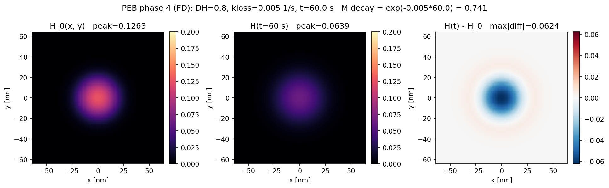
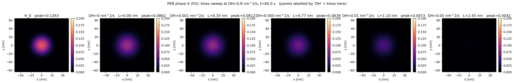
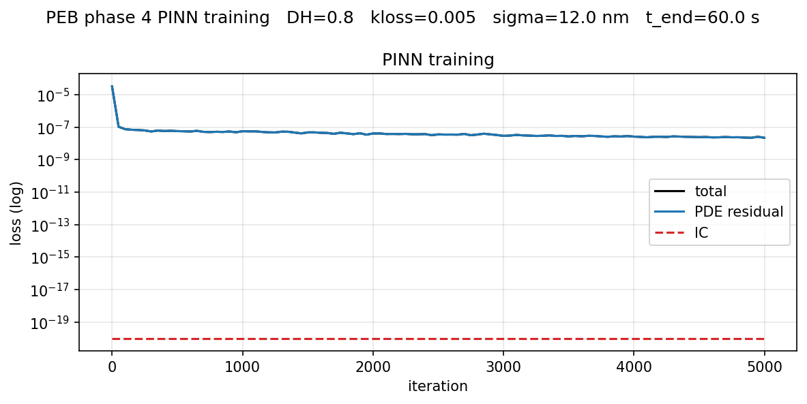
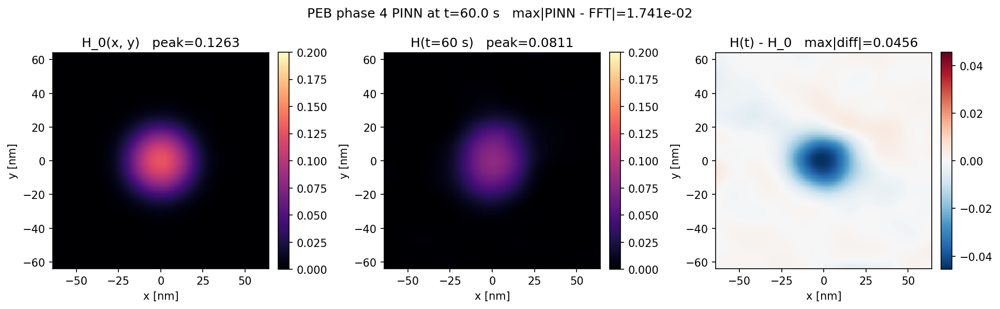
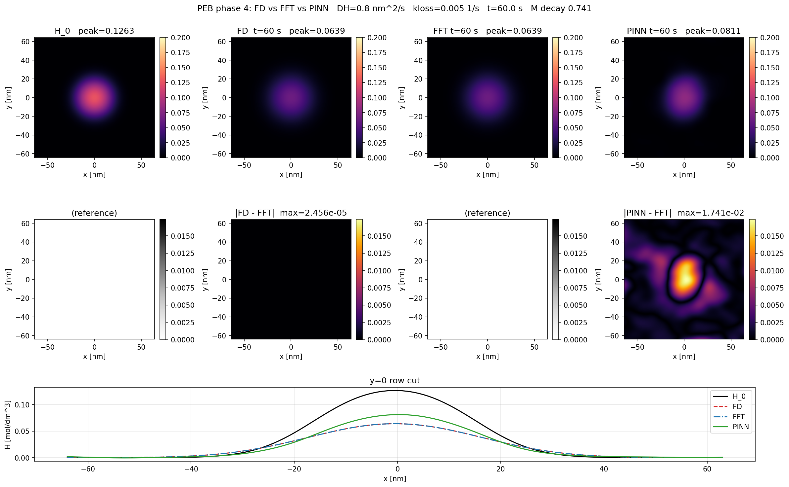

Metrics: [`peb_phase4_fd_metrics.csv`](outputs/logs/peb_phase4_fd_metrics.csv),
[`peb_phase4_compare_fd_pinn_metrics.csv`](outputs/logs/peb_phase4_compare_fd_pinn_metrics.csv)

Checkpoint: [`peb_phase4_pinn_acid_loss.pt`](outputs/checkpoints/peb_phase4_pinn_acid_loss.pt)

---

## Phase 5 — deprotection (P field)

`dP/dt = k_dep H (1 − P)` coupled to the Phase-4 acid equation.

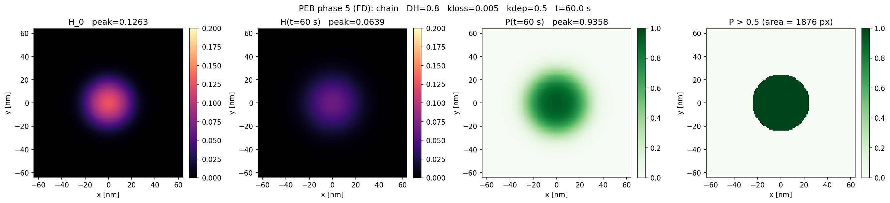
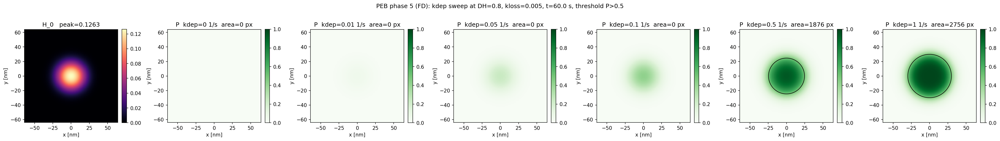
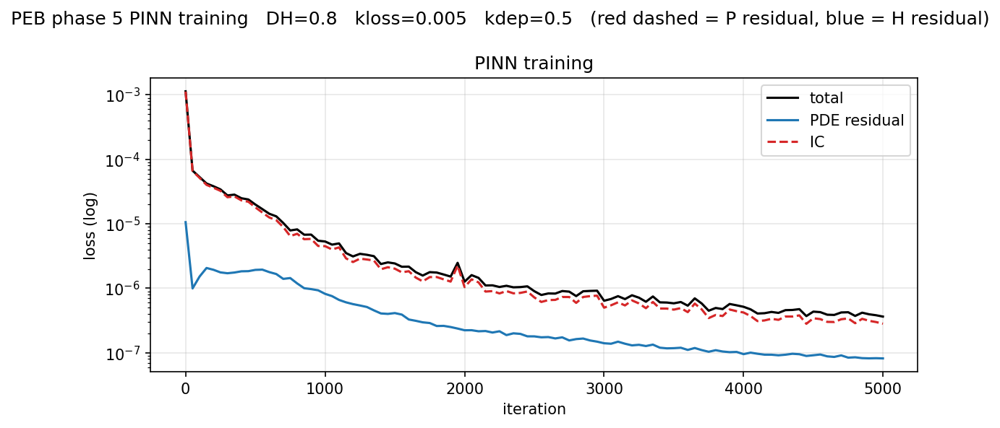
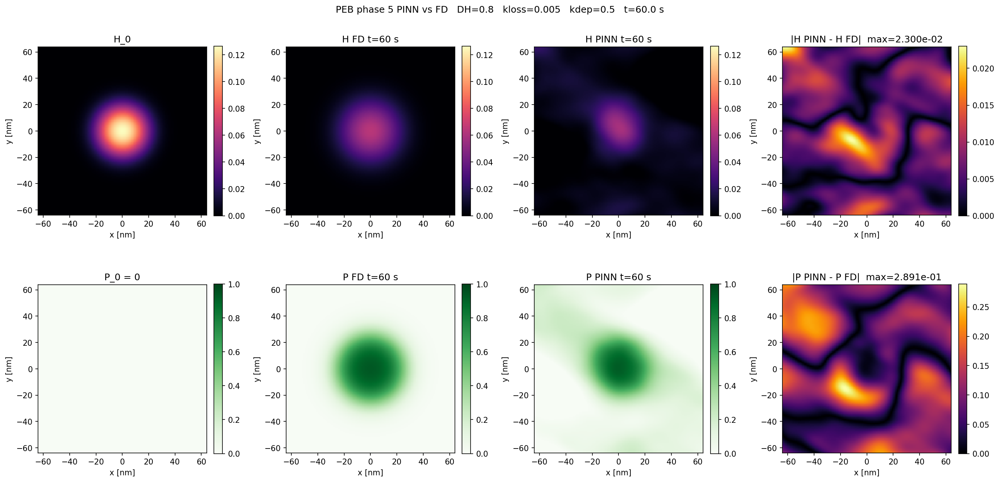


Metrics: [`peb_phase5_fd_kdep_metrics.csv`](outputs/logs/peb_phase5_fd_kdep_metrics.csv),
[`peb_phase5_fd_time_metrics.csv`](outputs/logs/peb_phase5_fd_time_metrics.csv),
[`peb_phase5_compare_fd_pinn_metrics.csv`](outputs/logs/peb_phase5_compare_fd_pinn_metrics.csv)

Checkpoint: [`peb_phase5_pinn_deprotection.pt`](outputs/checkpoints/peb_phase5_pinn_deprotection.pt)

---

## Pre-Phase-7 diagnostics

Mass-budget identity verification + PINN bound-penalty soft-term
(closes FUTURE_WORK items 1 and 4).

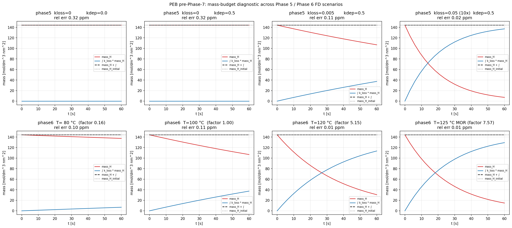
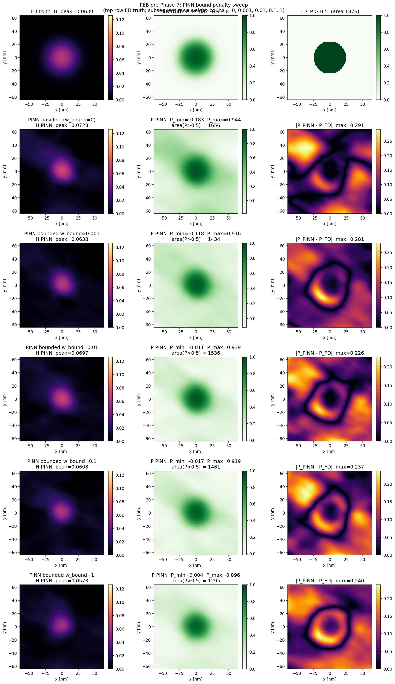

Metrics: [`peb_pre_phase7_mass_budget.csv`](outputs/logs/peb_pre_phase7_mass_budget.csv),
[`peb_pre_phase7_pinn_bound_metrics.csv`](outputs/logs/peb_pre_phase7_pinn_bound_metrics.csv)

Checkpoint: [`peb_pre_phase7_pinn_bounded.pt`](outputs/checkpoints/peb_pre_phase7_pinn_bounded.pt)

---

## Phase 6 — Arrhenius temperature dependence

`k(T) = k_ref · exp(−Ea/R · (1/T − 1/T_ref))` applied to `k_dep` /
`k_loss`. FD only.

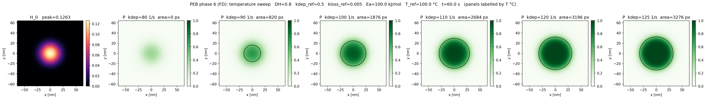
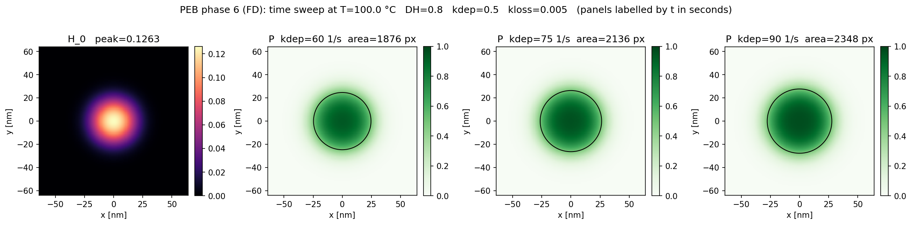

Metrics: [`peb_phase6_fd_temperature_sweep_metrics.csv`](outputs/logs/peb_phase6_fd_temperature_sweep_metrics.csv),
[`peb_phase6_fd_time_sweep_metrics.csv`](outputs/logs/peb_phase6_fd_time_sweep_metrics.csv),
[`peb_phase6_fd_zero_Ea_check.csv`](outputs/logs/peb_phase6_fd_zero_Ea_check.csv)

---

## Phase 7 — acid-quencher reaction

Bimolecular `−k_q H Q` term + quencher field Q, in safe (`k_q ∈ [1, 10]`)
and stiff (`k_q ∈ [100, 1000]`) regimes.

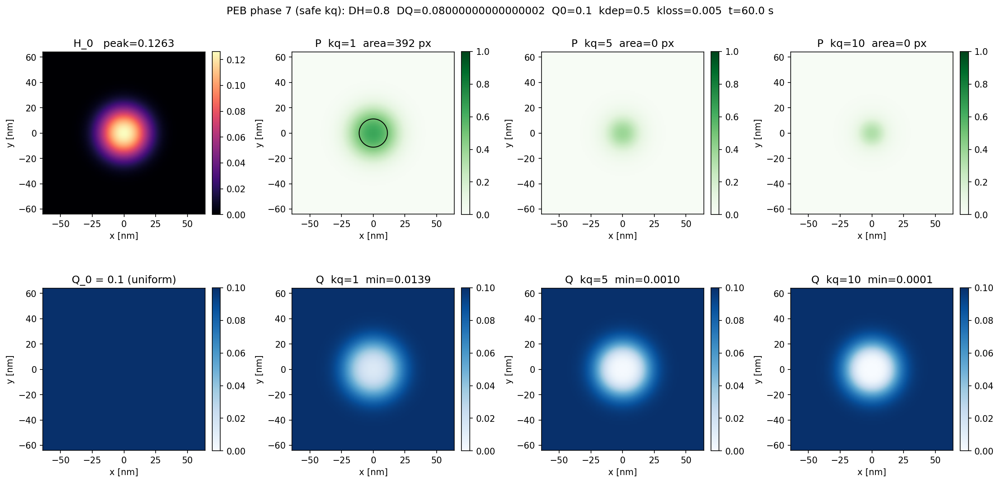
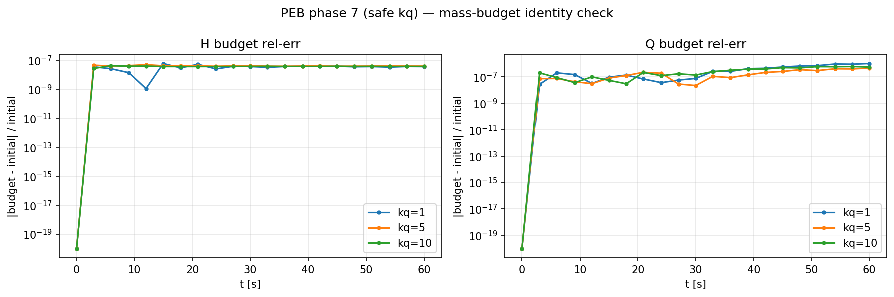
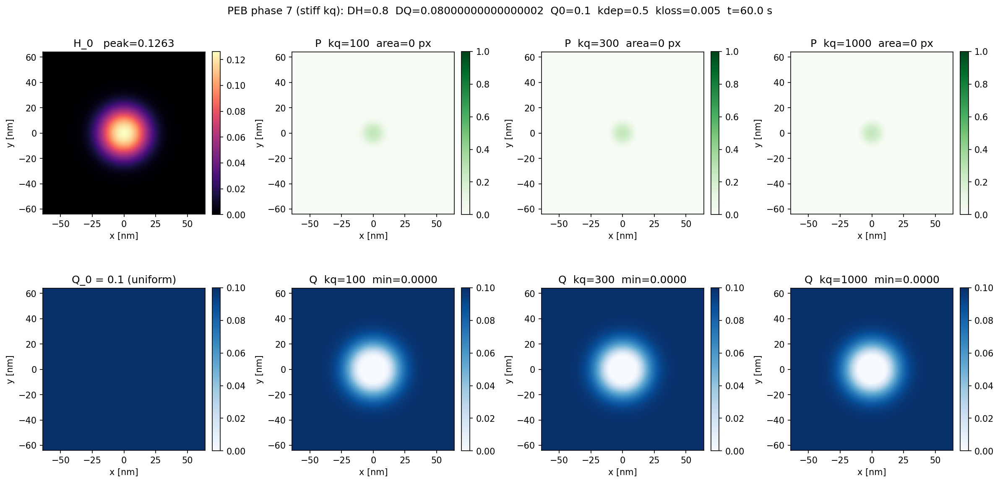
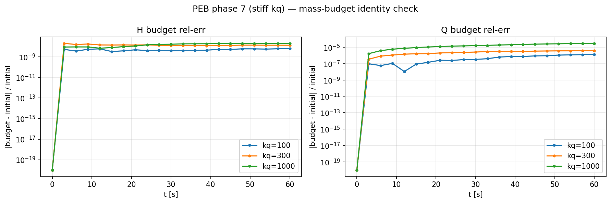

Metrics: [`peb_phase7_quencher_safe_metrics.csv`](outputs/logs/peb_phase7_quencher_safe_metrics.csv),
[`peb_phase7_quencher_safe_budget_history.csv`](outputs/logs/peb_phase7_quencher_safe_budget_history.csv),
[`peb_phase7_quencher_stiff_metrics.csv`](outputs/logs/peb_phase7_quencher_stiff_metrics.csv),
[`peb_phase7_quencher_stiff_budget_history.csv`](outputs/logs/peb_phase7_quencher_stiff_budget_history.csv)

---

## Phase 8 — full reaction-diffusion (Arrhenius + quencher integrated)

Term-disable check confirms reduction to Phases 2 / 4 / 6 / 7 to
machine precision.

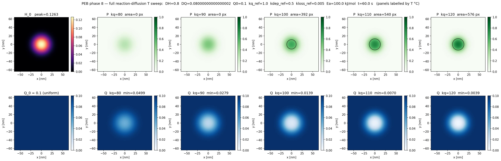
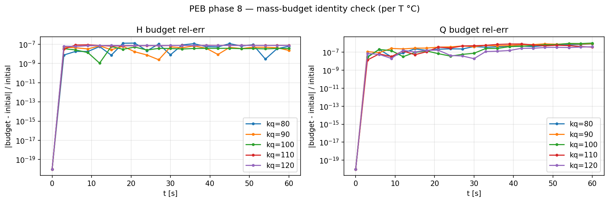

Metrics: [`peb_phase8_full_T_sweep_metrics.csv`](outputs/logs/peb_phase8_full_T_sweep_metrics.csv),
[`peb_phase8_term_disable_check.csv`](outputs/logs/peb_phase8_term_disable_check.csv)

---

## Phase 9 — dataset generation

Three archives in `outputs/datasets/` (gitignored, regenerable):
`peb_phase9_safe_dataset.npz` (64 samples), `peb_phase9_safe_large_dataset.npz`
(1024), `peb_phase9_stiff_dataset.npz` (8). Validation CSV shipped:

Metrics: [`peb_phase9_dataset_summary.csv`](outputs/logs/peb_phase9_dataset_summary.csv)

---

## Phase 10 — FNO operator surrogate

Two layers: original 64-sample demo + N=1024 ablation with optional
R-logit head. Ablation shows data size dominates: P rel-L2 0.98 → 0.09
on safe-test, IoU 0 → 0.28.

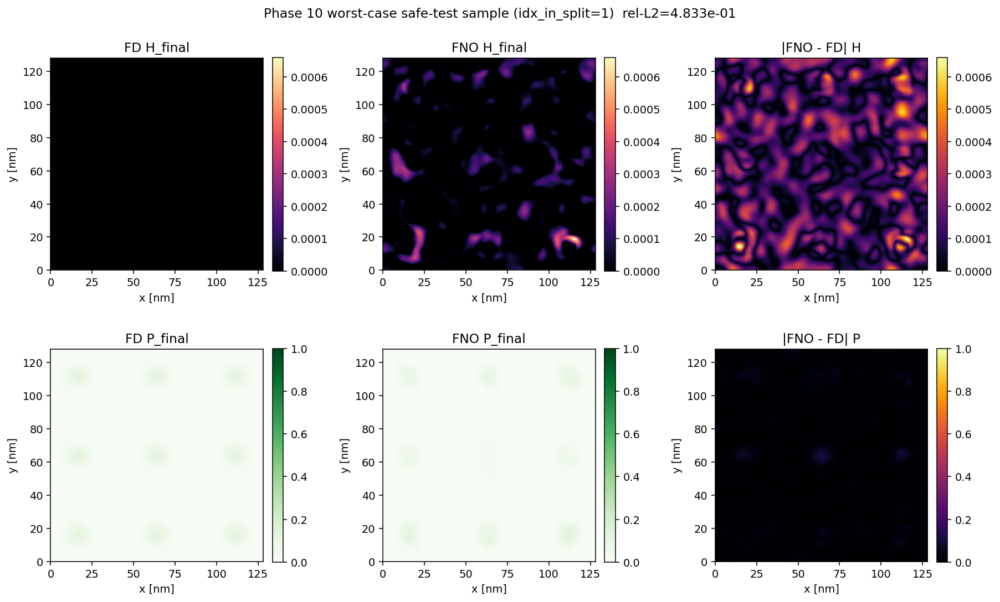

Metrics: [`peb_phase10_fno_training_history.csv`](outputs/logs/peb_phase10_fno_training_history.csv),
[`peb_phase10_fno_evaluation.csv`](outputs/logs/peb_phase10_fno_evaluation.csv),
[`peb_phase10_ablation_summary.csv`](outputs/logs/peb_phase10_ablation_summary.csv)

JSON summaries: [`peb_phase10_fno_training_summary.json`](outputs/logs/peb_phase10_fno_training_summary.json),
[`peb_phase10_fno_evaluation_summary.json`](outputs/logs/peb_phase10_fno_evaluation_summary.json),
[`peb_phase10_ablation_summary.json`](outputs/logs/peb_phase10_ablation_summary.json)

Checkpoints (5 × 17 MB):
[`peb_phase10_fno.pt`](outputs/checkpoints/peb_phase10_fno.pt) (original v1),
[`peb_phase10_fno_small_2out.pt`](outputs/checkpoints/peb_phase10_fno_small_2out.pt),
[`peb_phase10_fno_small_3out.pt`](outputs/checkpoints/peb_phase10_fno_small_3out.pt),
[`peb_phase10_fno_large_2out.pt`](outputs/checkpoints/peb_phase10_fno_large_2out.pt),
[`peb_phase10_fno_large_3out.pt`](outputs/checkpoints/peb_phase10_fno_large_3out.pt).

---

## Phase 11 — Petersen + stochastic layers

Petersen `D_H(P) = D_H0 · exp(α P)`, temperature-uniformity ensemble,
molecular blur. α=0 reproduces Phase 8 to float precision.


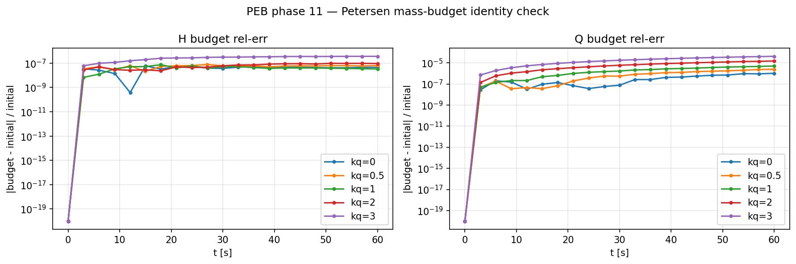
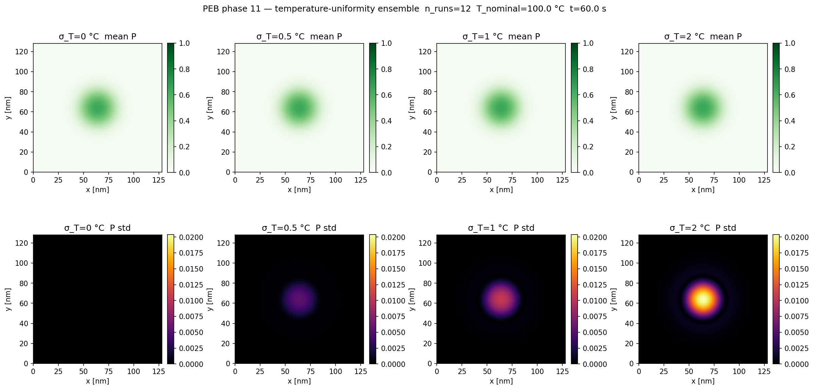
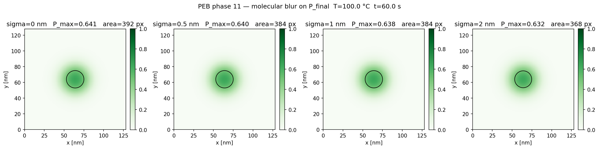

Metrics: [`peb_phase11_petersen_sweep_metrics.csv`](outputs/logs/peb_phase11_petersen_sweep_metrics.csv),
[`peb_phase11_temperature_uniformity_metrics.csv`](outputs/logs/peb_phase11_temperature_uniformity_metrics.csv),
[`peb_phase11_molecular_blur_metrics.csv`](outputs/logs/peb_phase11_molecular_blur_metrics.csv)
